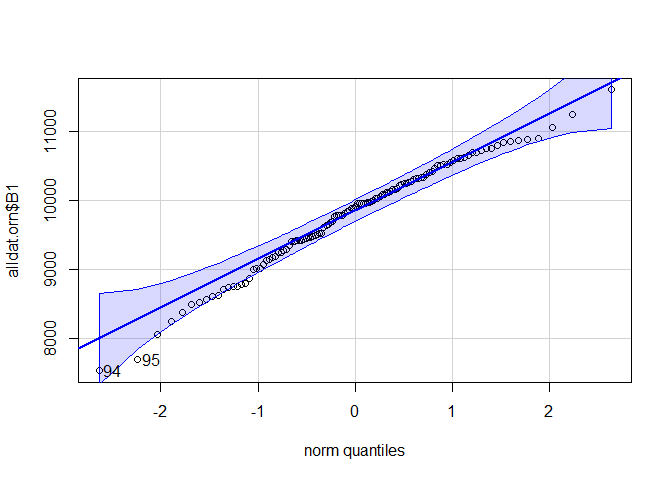
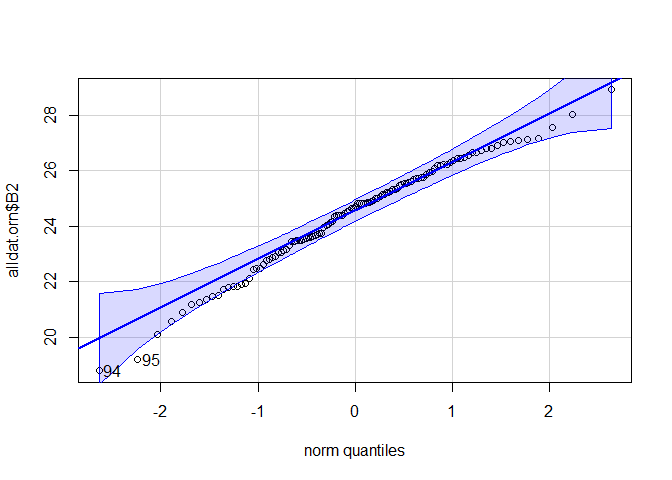
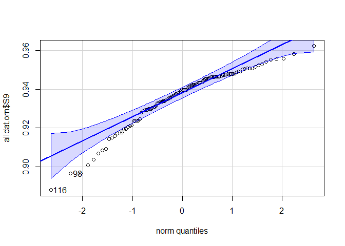
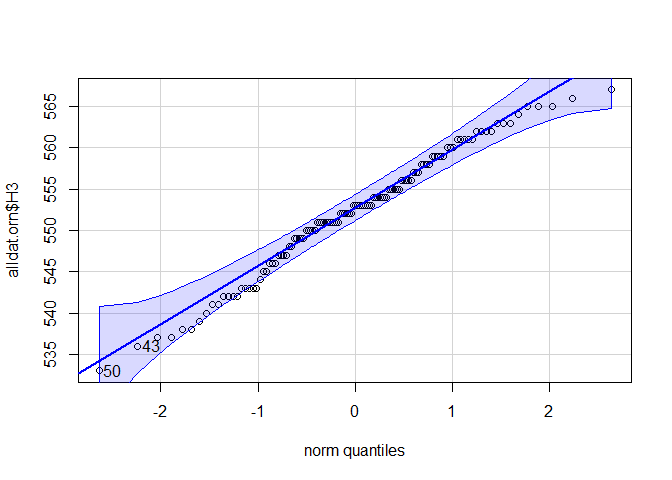
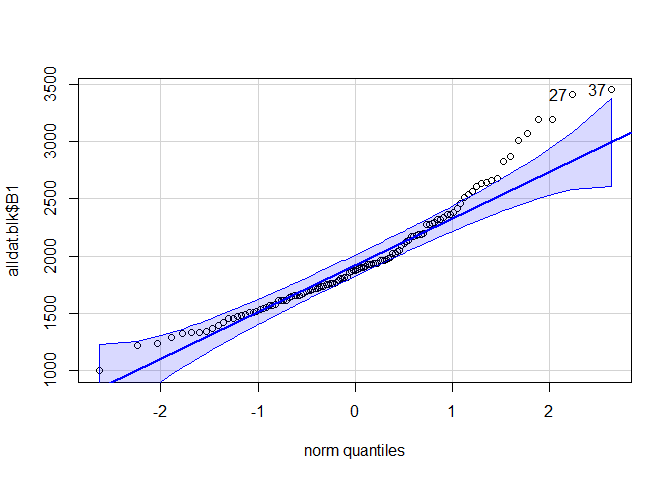

Analyses
================
Young Ha Suh, <ys757@cornell.edu>; Vanya Rohwer, <vgr7@cornell.edu>
11/06/2022

Libraries

``` r
# figures
library(car)
library(ggpubr)
library(ggpmisc)
library(cowplot)
#analyses
library(pavo)
library(lme4)
library(DHARMa)
```

Set ggplot themes for figures

``` r
mytheme <- theme(
  plot.title = element_text(size=20,face="bold",color="black"),      
  axis.text=element_text(size=16, color="black"),
  axis.title=element_text(size=18,face="bold",color="black"),
  axis.text.x=element_text(size=16, color="black"), 
  axis.text.y=element_text(size=16, color="black"),
  legend.text = element_text(size=16, color="black"),
  legend.title = element_text(size=16, color="black", face="bold"))

pal1 <- c("#ffa600", "#58508d")
pal2 <- c("#58508d", "#ffa600")
pal3 <- c("#635e50", "#e59500")
```

Load data

``` r
alldat.orn <- readRDS("alldat.orn.rds")
alldat.blk <- readRDS("alldat.blk.rds")
allspec.orn.avg <- readRDS("allspec.orn.avg.rds")
allcategory <- readRDS("allcategory.rds")
```

# Colorimetric variables

List of variables of interest (from Pavo package; references available
there) - `B1`: total brightness; sum of relative reflectance over entire
spectral range (area under the curve) - `S9`: carotenoid chroma; (R700 -
R450)/R700 - `H3`: hue/wavelength at Rmid; sensitive to noisy spectra

### Compare boxplots across specimen categories

Orange patches

``` r
dat <- alldat.orn

plot(B1 ~ cat, data = dat, ylab = "Total brightness (B1)", xlab = "Specimen category")
```

<!-- -->

``` r
plot(S9 ~ cat, data = dat, ylab = "Carotenoid chroma (S9)", xlab = "Specimen category")
```

<!-- -->

``` r
plot(H3 ~ cat, data = dat, ylab = "Hue (H3)", xlab = "Specimen category")
```

<!-- -->

Black patchess

``` r
dat <- alldat.blk
plot(B1 ~ cat, data = dat, ylab = "Total brightness (B1)", xlab = "Specimen category")
```

<!-- -->

### Check data

## Histograms

Normality

``` r
# Oranges
qqPlot(alldat.orn$B1)
```

<!-- -->

    ## [1] 94 95

``` r
qqPlot(alldat.orn$B2)
```

<!-- -->

    ## [1] 94 95

``` r
qqPlot(alldat.orn$S9)
```

<!-- -->

    ## [1] 116  98

``` r
qqPlot(alldat.orn$H3)
```

<!-- -->

    ## [1] 50 43

``` r
# Black
qqPlot(alldat.blk$B1)
```

<!-- -->

    ## [1] 37 27

Compare variances

``` r
table(alldat.orn[which(alldat.orn$sp == "Bull"),]$cat)
```

    ## 
    ## Balt_hist  Balt_mod Bull_hist  Bull_mod  Bull_ref 
    ##         0         0        20        20        40

``` r
bullchk <- alldat.orn[which(alldat.orn$cat == "Bull_mod" | alldat.orn$cat == "Bull_hist"),]
baltchk <- alldat.orn[which(alldat.orn$cat == "Balt_mod" | alldat.orn$cat == "Balt_hist"),]

# F-test
res <- var.test(B1 ~ cat, data = bullchk)
res 
```

    ## 
    ##  F test to compare two variances
    ## 
    ## data:  B1 by cat
    ## F = 0.93703, num df = 19, denom df = 19, p-value = 0.8888
    ## alternative hypothesis: true ratio of variances is not equal to 1
    ## 95 percent confidence interval:
    ##  0.3708883 2.3673629
    ## sample estimates:
    ## ratio of variances 
    ##           0.937031

``` r
#F = 0.93703, num df = 19, denom df = 19, p-value = 0.8888
#there is no significant difference between the two variances

res <- var.test(S9 ~ cat, data = bullchk)
res 
```

    ## 
    ##  F test to compare two variances
    ## 
    ## data:  S9 by cat
    ## F = 2.3205, num df = 19, denom df = 19, p-value = 0.07421
    ## alternative hypothesis: true ratio of variances is not equal to 1
    ## 95 percent confidence interval:
    ##  0.9184907 5.8626842
    ## sample estimates:
    ## ratio of variances 
    ##           2.320522

``` r
#F = 2.3205, num df = 19, denom df = 19, p-value = 0.07421

res <- var.test(H3 ~ cat, data = bullchk)
res 
```

    ## 
    ##  F test to compare two variances
    ## 
    ## data:  H3 by cat
    ## F = 2.4874, num df = 19, denom df = 19, p-value = 0.05384
    ## alternative hypothesis: true ratio of variances is not equal to 1
    ## 95 percent confidence interval:
    ##  0.9845623 6.2844160
    ## sample estimates:
    ## ratio of variances 
    ##           2.487448

``` r
#F = 2.4874, num df = 19, denom df = 19, p-value = 0.05384

#############
# Baltimores
res1 <- var.test(B1 ~ cat, data = baltchk)
res1
```

    ## 
    ##  F test to compare two variances
    ## 
    ## data:  B1 by cat
    ## F = 0.87801, num df = 19, denom df = 18, p-value = 0.7793
    ## alternative hypothesis: true ratio of variances is not equal to 1
    ## 95 percent confidence interval:
    ##  0.3407848 2.2351479
    ## sample estimates:
    ## ratio of variances 
    ##          0.8780065

``` r
#F = 0.87801, num df = 19, denom df = 18, p-value = 0.7793

res1 <- var.test(S9 ~ cat, data = baltchk)
res1
```

    ## 
    ##  F test to compare two variances
    ## 
    ## data:  S9 by cat
    ## F = 5.7141, num df = 19, denom df = 18, p-value = 0.0005181
    ## alternative hypothesis: true ratio of variances is not equal to 1
    ## 95 percent confidence interval:
    ##   2.217842 14.546436
    ## sample estimates:
    ## ratio of variances 
    ##           5.714103

``` r
#F = 5.7141, num df = 19, denom df = 18, p-value = 0.0005181 -> ????????????? 

res1 <- var.test(H3 ~ cat, data = baltchk)
res1
```

    ## 
    ##  F test to compare two variances
    ## 
    ## data:  H3 by cat
    ## F = 0.76303, num df = 19, denom df = 18, p-value = 0.5635
    ## alternative hypothesis: true ratio of variances is not equal to 1
    ## 95 percent confidence interval:
    ##  0.2961586 1.9424521
    ## sample estimates:
    ## ratio of variances 
    ##          0.7630303

``` r
#F = 0.76303, num df = 19, denom df = 18, p-value = 0.5635


################
# Same for black patch
bullchk1 <- alldat.blk[which(alldat.blk$cat == "Bull_mod" | alldat.blk$cat == "Bull_hist"),]
baltchk1 <- alldat.blk[which(alldat.blk$cat == "Balt_mod" | alldat.blk$cat == "Balt_hist"),]

# F-test
res <- var.test(B1 ~ cat, data = bullchk1)
res  #F = 0.5821, num df = 19, denom df = 19, p-value = 0.2473
```

    ## 
    ##  F test to compare two variances
    ## 
    ## data:  B1 by cat
    ## F = 0.5821, num df = 19, denom df = 19, p-value = 0.2473
    ## alternative hypothesis: true ratio of variances is not equal to 1
    ## 95 percent confidence interval:
    ##  0.2304012 1.4706405
    ## sample estimates:
    ## ratio of variances 
    ##          0.5820974

``` r
res <- var.test(B1 ~ cat, data = baltchk1)
res  #F = 0.45773, num df = 19, denom df = 18, p-value = 0.09953
```

    ## 
    ##  F test to compare two variances
    ## 
    ## data:  B1 by cat
    ## F = 0.45773, num df = 19, denom df = 18, p-value = 0.09953
    ## alternative hypothesis: true ratio of variances is not equal to 1
    ## 95 percent confidence interval:
    ##  0.1776607 1.1652456
    ## sample estimates:
    ## ratio of variances 
    ##          0.4577295

``` r
##############
# Use Levene Test
library(car)
leveneTest(B1 ~ cat, data = bullchk) #0.001 0.9754
```

    ## Levene's Test for Homogeneity of Variance (center = median)
    ##       Df F value Pr(>F)
    ## group  1   0.001 0.9754
    ##       38

``` r
leveneTest(S9 ~ cat, data = bullchk) #5.8549 0.02043 *
```

    ## Levene's Test for Homogeneity of Variance (center = median)
    ##       Df F value  Pr(>F)  
    ## group  1  5.8549 0.02043 *
    ##       38                  
    ## ---
    ## Signif. codes:  0 '***' 0.001 '**' 0.01 '*' 0.05 '.' 0.1 ' ' 1

``` r
leveneTest(H3 ~ cat, data = bullchk) #4.0309 0.05182 .
```

    ## Levene's Test for Homogeneity of Variance (center = median)
    ##       Df F value  Pr(>F)  
    ## group  1  4.0309 0.05182 .
    ##       38                  
    ## ---
    ## Signif. codes:  0 '***' 0.001 '**' 0.01 '*' 0.05 '.' 0.1 ' ' 1

``` r
leveneTest(B1 ~ cat, data = baltchk) #0.0336 0.8555
```

    ## Levene's Test for Homogeneity of Variance (center = median)
    ##       Df F value Pr(>F)
    ## group  1  0.0336 0.8555
    ##       37

``` r
leveneTest(S9 ~ cat, data = baltchk) #3.9957  0.053 .
```

    ## Levene's Test for Homogeneity of Variance (center = median)
    ##       Df F value Pr(>F)  
    ## group  1  3.9957  0.053 .
    ##       37                 
    ## ---
    ## Signif. codes:  0 '***' 0.001 '**' 0.01 '*' 0.05 '.' 0.1 ' ' 1

``` r
leveneTest(H3 ~ cat, data = baltchk) #0.0034 0.9538
```

    ## Levene's Test for Homogeneity of Variance (center = median)
    ##       Df F value Pr(>F)
    ## group  1  0.0034 0.9538
    ##       37

``` r
leveneTest(B1 ~ cat, data = bullchk1) # 1.052 0.3115
```

    ## Levene's Test for Homogeneity of Variance (center = median)
    ##       Df F value Pr(>F)
    ## group  1   1.052 0.3115
    ##       38

``` r
leveneTest(B1 ~ cat, data = baltchk1) #1.1375 0.2931
```

    ## Levene's Test for Homogeneity of Variance (center = median)
    ##       Df F value Pr(>F)
    ## group  1  1.1375 0.2931
    ##       37

Based on variances, use appropriate comparative tests:

``` r
# Bullock's
t.test(B1 ~ cat, data = bullchk) #t = 1.4878, df = 37.96, p-value = 0.1451
```

    ## 
    ##  Welch Two Sample t-test
    ## 
    ## data:  B1 by cat
    ## t = 1.4878, df = 37.96, p-value = 0.1451
    ## alternative hypothesis: true difference in means between group Bull_hist and group Bull_mod is not equal to 0
    ## 95 percent confidence interval:
    ##  -124.5725  815.2773
    ## sample estimates:
    ## mean in group Bull_hist  mean in group Bull_mod 
    ##                9887.548                9542.195

``` r
wilcox.test(S9 ~ cat, data = bullchk) #W = 61, p-value = 7.938e-05
```

    ## 
    ##  Wilcoxon rank sum exact test
    ## 
    ## data:  S9 by cat
    ## W = 61, p-value = 7.938e-05
    ## alternative hypothesis: true location shift is not equal to 0

``` r
t.test(H3 ~ cat, data = bullchk) #t = -4.8794, df = 32.151, p-value = 2.791e-05
```

    ## 
    ##  Welch Two Sample t-test
    ## 
    ## data:  H3 by cat
    ## t = -4.8794, df = 32.151, p-value = 2.791e-05
    ## alternative hypothesis: true difference in means between group Bull_hist and group Bull_mod is not equal to 0
    ## 95 percent confidence interval:
    ##  -15.449445  -6.350555
    ## sample estimates:
    ## mean in group Bull_hist  mean in group Bull_mod 
    ##                  546.35                  557.25

``` r
# Baltimore
t.test(B1 ~ cat, data = baltchk) #t = 1.2933, df = 36.496, p-value = 0.204
```

    ## 
    ##  Welch Two Sample t-test
    ## 
    ## data:  B1 by cat
    ## t = 1.2933, df = 36.496, p-value = 0.204
    ## alternative hypothesis: true difference in means between group Balt_hist and group Balt_mod is not equal to 0
    ## 95 percent confidence interval:
    ##  -144.9947  656.0373
    ## sample estimates:
    ## mean in group Balt_hist  mean in group Balt_mod 
    ##               10141.182                9885.661

``` r
wilcox.test(S9 ~ cat, data = baltchk) #W = 161, p-value = 0.4276
```

    ## 
    ##  Wilcoxon rank sum exact test
    ## 
    ## data:  S9 by cat
    ## W = 161, p-value = 0.4276
    ## alternative hypothesis: true location shift is not equal to 0

``` r
t.test(H3 ~ cat, data = baltchk) #t = 2.7705, df = 35.755, p-value = 0.008821
```

    ## 
    ##  Welch Two Sample t-test
    ## 
    ## data:  H3 by cat
    ## t = 2.7705, df = 35.755, p-value = 0.008821
    ## alternative hypothesis: true difference in means between group Balt_hist and group Balt_mod is not equal to 0
    ## 95 percent confidence interval:
    ##  0.9316828 6.0262119
    ## sample estimates:
    ## mean in group Balt_hist  mean in group Balt_mod 
    ##                556.9000                553.4211

``` r
# black patches
wilcox.test(B1 ~ cat, data = bullchk1) #W = 127, p-value = 0.04909
```

    ## 
    ##  Wilcoxon rank sum exact test
    ## 
    ## data:  B1 by cat
    ## W = 127, p-value = 0.04909
    ## alternative hypothesis: true location shift is not equal to 0

``` r
wilcox.test(B1 ~ cat, data = baltchk1) #W = 83, p-value = 0.002121
```

    ## 
    ##  Wilcoxon rank sum exact test
    ## 
    ## data:  B1 by cat
    ## W = 83, p-value = 0.002121
    ## alternative hypothesis: true location shift is not equal to 0

<br>

# Statistical analyses

## H1. Have specimens faded over time?

To test for specimen fauxing, look at colorimetric measures over time.

### 1. Orange patches over time

Check brightness, carotenoid chroma, hue

1.  Brightness

``` r
# Both species
lm_orn_both_b1 <- lm(B1 ~ date, data = alldat.orn)
summary(lm_orn_both_b1)
```

    ## 
    ## Call:
    ## lm(formula = B1 ~ date, data = alldat.orn)
    ## 
    ## Residuals:
    ##     Min      1Q  Median      3Q     Max 
    ## -2208.7  -423.0   111.5   558.7  1823.2 
    ## 
    ## Coefficients:
    ##              Estimate Std. Error t value Pr(>|t|)    
    ## (Intercept) 9.786e+03  7.279e+01  134.45   <2e-16 ***
    ## date        2.864e-03  5.620e-03    0.51    0.611    
    ## ---
    ## Signif. codes:  0 '***' 0.001 '**' 0.01 '*' 0.05 '.' 0.1 ' ' 1
    ## 
    ## Residual standard error: 763.6 on 117 degrees of freedom
    ## Multiple R-squared:  0.002214,   Adjusted R-squared:  -0.006314 
    ## F-statistic: 0.2596 on 1 and 117 DF,  p-value: 0.6113

``` r
# Bullock's
lm_orn_BU_b1 <- lm(B1 ~ date, data = alldat.orn[which(alldat.orn$sp == "Bull"),])
summary(lm_orn_BU_b1)
```

    ## 
    ## Call:
    ## lm(formula = B1 ~ date, data = alldat.orn[which(alldat.orn$sp == 
    ##     "Bull"), ])
    ## 
    ## Residuals:
    ##      Min       1Q   Median       3Q      Max 
    ## -2057.20  -515.73    87.37   565.12  1945.41 
    ## 
    ## Coefficients:
    ##              Estimate Std. Error t value Pr(>|t|)    
    ## (Intercept) 9.676e+03  9.139e+01 105.874   <2e-16 ***
    ## date        5.624e-03  6.931e-03   0.812     0.42    
    ## ---
    ## Signif. codes:  0 '***' 0.001 '**' 0.01 '*' 0.05 '.' 0.1 ' ' 1
    ## 
    ## Residual standard error: 804.4 on 78 degrees of freedom
    ## Multiple R-squared:  0.008372,   Adjusted R-squared:  -0.004341 
    ## F-statistic: 0.6585 on 1 and 78 DF,  p-value: 0.4195

``` r
# Baltimore
lm_orn_BA_b1 <- lm(B1 ~ date, data = alldat.orn[which(alldat.orn$sp == "Balt"),])
summary(lm_orn_BA_b1)
```

    ## 
    ## Call:
    ## lm(formula = B1 ~ date, data = alldat.orn[which(alldat.orn$sp == 
    ##     "Balt"), ])
    ## 
    ## Residuals:
    ##      Min       1Q   Median       3Q      Max 
    ## -1399.98  -304.34    99.23   363.49  1162.44 
    ## 
    ## Coefficients:
    ##               Estimate Std. Error t value Pr(>|t|)    
    ## (Intercept)  1.009e+04  1.126e+02   89.56   <2e-16 ***
    ## date        -1.176e-02  9.044e-03   -1.30    0.201    
    ## ---
    ## Signif. codes:  0 '***' 0.001 '**' 0.01 '*' 0.05 '.' 0.1 ' ' 1
    ## 
    ## Residual standard error: 615.6 on 37 degrees of freedom
    ## Multiple R-squared:  0.04371,    Adjusted R-squared:  0.01786 
    ## F-statistic: 1.691 on 1 and 37 DF,  p-value: 0.2015

``` r
# Plot both
ggplot(alldat.orn, aes(x = date, y = B1, shape = spc, color = spc)) +
  geom_point(size = 2) +
  stat_smooth(method = lm, aes(fill = spc), se = T) +
  theme_classic() +
  mytheme +
  stat_fit_glance(method = "lm", label.x = "right", label.y = "bottom",
                        method.args = list(formula = y ~ x), size = 5, 
                        aes(label = sprintf('R^2~"="~%.3f~~italic(p)~"="~%.3f',
                                            stat(..r.squared..), stat(..p.value..))), 
                  parse = TRUE) + 
  labs(title = "Orange patches only", y = "Total brightness (B1)", x = "Collection date", 
       color = "Species", fill = "Species", shape = "Species") +
  scale_color_manual(values = pal1) +
  scale_fill_manual(values = pal1)
```

<!-- -->

2.  Carotenoid chroma

``` r
# Both species
lm_orn_both_s9 <- lm(S9 ~ date, data = alldat.orn)
summary(lm_orn_both_s9)
```

    ## 
    ## Call:
    ## lm(formula = S9 ~ date, data = alldat.orn)
    ## 
    ## Residuals:
    ##       Min        1Q    Median        3Q       Max 
    ## -0.050172 -0.005326  0.002971  0.009081  0.023683 
    ## 
    ## Coefficients:
    ##              Estimate Std. Error t value Pr(>|t|)    
    ## (Intercept) 9.354e-01  1.319e-03 709.333   <2e-16 ***
    ## date        2.244e-07  1.018e-07   2.204   0.0295 *  
    ## ---
    ## Signif. codes:  0 '***' 0.001 '**' 0.01 '*' 0.05 '.' 0.1 ' ' 1
    ## 
    ## Residual standard error: 0.01383 on 117 degrees of freedom
    ## Multiple R-squared:  0.03987,    Adjusted R-squared:  0.03166 
    ## F-statistic: 4.858 on 1 and 117 DF,  p-value: 0.02947

``` r
# Bullock's
lm_orn_BU_s9 <- lm(S9 ~ date, data = alldat.orn[which(alldat.orn$sp == "Bull"),])
summary(lm_orn_BU_s9)
```

    ## 
    ## Call:
    ## lm(formula = S9 ~ date, data = alldat.orn[which(alldat.orn$sp == 
    ##     "Bull"), ])
    ## 
    ## Residuals:
    ##       Min        1Q    Median        3Q       Max 
    ## -0.048236 -0.008618  0.003119  0.010649  0.025134 
    ## 
    ## Coefficients:
    ##              Estimate Std. Error t value Pr(>|t|)    
    ## (Intercept) 9.340e-01  1.647e-03 566.984   <2e-16 ***
    ## date        1.834e-07  1.249e-07   1.468    0.146    
    ## ---
    ## Signif. codes:  0 '***' 0.001 '**' 0.01 '*' 0.05 '.' 0.1 ' ' 1
    ## 
    ## Residual standard error: 0.0145 on 78 degrees of freedom
    ## Multiple R-squared:  0.0269, Adjusted R-squared:  0.01442 
    ## F-statistic: 2.156 on 1 and 78 DF,  p-value: 0.146

``` r
# Baltimore
lm_orn_BA_s9 <- lm(S9 ~ date, data = alldat.orn[which(alldat.orn$sp == "Balt"),])
summary(lm_orn_BA_s9)
```

    ## 
    ## Call:
    ## lm(formula = S9 ~ date, data = alldat.orn[which(alldat.orn$sp == 
    ##     "Balt"), ])
    ## 
    ## Residuals:
    ##       Min        1Q    Median        3Q       Max 
    ## -0.040891 -0.004822  0.002226  0.006510  0.020737 
    ## 
    ## Coefficients:
    ##              Estimate Std. Error t value Pr(>|t|)    
    ## (Intercept) 9.385e-01  2.208e-03 425.044   <2e-16 ***
    ## date        2.455e-07  1.773e-07   1.385    0.174    
    ## ---
    ## Signif. codes:  0 '***' 0.001 '**' 0.01 '*' 0.05 '.' 0.1 ' ' 1
    ## 
    ## Residual standard error: 0.01207 on 37 degrees of freedom
    ## Multiple R-squared:  0.04929,    Adjusted R-squared:  0.02359 
    ## F-statistic: 1.918 on 1 and 37 DF,  p-value: 0.1743

``` r
# Plot both
ggplot(alldat.orn, aes(x = date, y = S9, shape = spc, color = spc)) +
  geom_point(size = 2) +
  stat_smooth(method = lm, aes(fill = spc), se = T) +
  theme_classic() +
  mytheme +
  stat_fit_glance(method = "lm", label.x = "right", label.y = "bottom",
                        method.args = list(formula = y ~ x), size = 5, 
                        aes(label = sprintf('R^2~"="~%.3f~~italic(p)~"="~%.3f',
                                            stat(..r.squared..), stat(..p.value..))), 
                  parse = TRUE) + 
  labs(title = "Orange patches only", y = "Carotenoid chroma (S9)", x = "Collection date", 
       color = "Species", fill = "Species", shape = "Species") +
  scale_color_manual(values = pal1) +
  scale_fill_manual(values = pal1)
```

<!-- -->

3.  Hue

``` r
# Both species
lm_orn_both_h3 <- lm(H3 ~ date, data = alldat.orn)
summary(lm_orn_both_h3)
```

    ## 
    ## Call:
    ## lm(formula = H3 ~ date, data = alldat.orn)
    ## 
    ## Residuals:
    ##      Min       1Q   Median       3Q      Max 
    ## -18.3067  -3.7834  -0.3465   5.2359  14.6545 
    ## 
    ## Coefficients:
    ##              Estimate Std. Error t value Pr(>|t|)    
    ## (Intercept) 5.519e+02  6.902e-01 799.599   <2e-16 ***
    ## date        1.104e-04  5.329e-05   2.072   0.0405 *  
    ## ---
    ## Signif. codes:  0 '***' 0.001 '**' 0.01 '*' 0.05 '.' 0.1 ' ' 1
    ## 
    ## Residual standard error: 7.24 on 117 degrees of freedom
    ## Multiple R-squared:  0.03538,    Adjusted R-squared:  0.02713 
    ## F-statistic: 4.291 on 1 and 117 DF,  p-value: 0.04051

``` r
# Bullock's
lm_orn_BU_h3 <- lm(H3 ~ date, data = alldat.orn[which(alldat.orn$sp == "Bull"),])
summary(lm_orn_BU_h3)
```

    ## 
    ## Call:
    ## lm(formula = H3 ~ date, data = alldat.orn[which(alldat.orn$sp == 
    ##     "Bull"), ])
    ## 
    ## Residuals:
    ##      Min       1Q   Median       3Q      Max 
    ## -16.5275  -6.3942  -0.4725   6.4996  14.2262 
    ## 
    ## Coefficients:
    ##              Estimate Std. Error t value Pr(>|t|)    
    ## (Intercept) 5.504e+02  8.871e-01 620.411   <2e-16 ***
    ## date        1.747e-04  6.728e-05   2.597   0.0112 *  
    ## ---
    ## Signif. codes:  0 '***' 0.001 '**' 0.01 '*' 0.05 '.' 0.1 ' ' 1
    ## 
    ## Residual standard error: 7.808 on 78 degrees of freedom
    ## Multiple R-squared:  0.07961,    Adjusted R-squared:  0.06781 
    ## F-statistic: 6.746 on 1 and 78 DF,  p-value: 0.01122

``` r
# Baltimore
lm_orn_BA_h3 <- lm(H3 ~ date, data = alldat.orn[which(alldat.orn$sp == "Balt"),])
summary(lm_orn_BA_h3)
```

    ## 
    ## Call:
    ## lm(formula = H3 ~ date, data = alldat.orn[which(alldat.orn$sp == 
    ##     "Balt"), ])
    ## 
    ## Residuals:
    ##     Min      1Q  Median      3Q     Max 
    ## -7.4545 -2.4008 -0.4553  2.0983  9.5450 
    ## 
    ## Coefficients:
    ##               Estimate Std. Error t value Pr(>|t|)    
    ## (Intercept)  5.562e+02  7.142e-01 778.706   <2e-16 ***
    ## date        -1.600e-04  5.735e-05  -2.789   0.0083 ** 
    ## ---
    ## Signif. codes:  0 '***' 0.001 '**' 0.01 '*' 0.05 '.' 0.1 ' ' 1
    ## 
    ## Residual standard error: 3.904 on 37 degrees of freedom
    ## Multiple R-squared:  0.1737, Adjusted R-squared:  0.1514 
    ## F-statistic:  7.78 on 1 and 37 DF,  p-value: 0.008299

``` r
# Plot both
ggplot(alldat.orn, aes(x = date, y = H3, shape = spc, color = spc)) +
  geom_point(size = 2) +
  stat_smooth(method = lm, aes(fill = spc), se = T) +
  theme_classic() +
  mytheme +
  stat_fit_glance(method = "lm", label.x = "right", label.y = "bottom",
                        method.args = list(formula = y ~ x), size = 5, 
                        aes(label = sprintf('R^2~"="~%.3f~~italic(p)~"="~%.3f',
                                            stat(..r.squared..), stat(..p.value..))), 
                  parse = TRUE) + 
  labs(title = "Orange patches only", y = "Hue (H3)", x = "Collection date", 
       color = "Species", fill = "Species", shape = "Species") +
  scale_color_manual(values = pal1) +
  scale_fill_manual(values = pal1)
```

<!-- -->

### 2. Black patches over time

Check brightness

``` r
lm_black <- lm(B1 ~ date, data = alldat.blk)
summary(lm_black)
```

    ## 
    ## Call:
    ## lm(formula = B1 ~ date, data = alldat.blk)
    ## 
    ## Residuals:
    ##      Min       1Q   Median       3Q      Max 
    ## -1111.32  -276.65   -81.05   221.07  1402.48 
    ## 
    ## Coefficients:
    ##              Estimate Std. Error t value Pr(>|t|)    
    ## (Intercept) 1.914e+03  4.366e+01  43.837  < 2e-16 ***
    ## date        1.109e-02  3.371e-03   3.288  0.00133 ** 
    ## ---
    ## Signif. codes:  0 '***' 0.001 '**' 0.01 '*' 0.05 '.' 0.1 ' ' 1
    ## 
    ## Residual standard error: 458 on 117 degrees of freedom
    ## Multiple R-squared:  0.0846, Adjusted R-squared:  0.07678 
    ## F-statistic: 10.81 on 1 and 117 DF,  p-value: 0.001332

``` r
# plot
ggplot(alldat.blk, aes(x = date, y = B1, shape = spc, color = spc)) +
  geom_point(size = 2) +
  stat_smooth(method = lm, aes(fill = spc), se = T) +
  theme_classic() +
  mytheme +
  stat_fit_glance(method = "lm", label.x = "right", label.y = "bottom",
                        method.args = list(formula = y ~ x), size = 5, 
                        aes(label = sprintf('R^2~"="~%.3f~~italic(p)~"="~%.3f',
                                            stat(..r.squared..), stat(..p.value..))), 
                  parse = TRUE) + 
  labs(title = "Black patches only", y = "Brightness (B1)", x = "Collection date", 
       color = "Species", fill = "Species", shape = "Species") +
  scale_color_manual(values = pal1) +
  scale_fill_manual(values = pal1)
```

<!-- -->

<br>

## H2. Have landuse changes affected Bullock’s orioles?

Compare reference vs. hybrid zone

``` r
# Select categories for comparison 
compare <- alldat.orn[which(alldat.orn$cat == "Bull_mod" | 
                            alldat.orn$cat == "Bull_hist" | 
                            alldat.orn$cat == "Balt_mod" | 
                            alldat.orn$cat == "Balt_hist"),]

# List for comparisons
comparelist <- list(c("Bull_hist", "Bull_mod"), c("Balt_hist", "Balt_mod"))


############
# for black patches
compare1 <- alldat.blk[which(alldat.blk$cat == "Bull_mod" | 
                             alldat.blk$cat == "Bull_hist" | 
                             alldat.blk$cat == "Balt_mod" | 
                             alldat.blk$cat == "Balt_hist"),]
```

1.  Brightness boxplots

``` r
b1orn <- ggplot(compare, aes(x = cat, y = B1, fill = sp)) +
  stat_boxplot(aes(x = cat, y = B1), geom = "errorbar", 
               position = position_dodge(width = .75), width = .5) +
  geom_boxplot(outlier.size = 1.5, position = position_dodge(width = .75), col = "black") +
  stat_compare_means(comparisons = comparelist, method = "t.test", label = "p.signif", size = 6) +
  theme_classic()+
  mytheme +
  labs(y = "Total brightness (B1)") +
  scale_fill_manual(values = pal1, name = "Species", 
                    limits = c("Bull", "Balt"), 
                    labels = c(expression(italic("Icterus bullockii")), 
                               expression(italic("Icterus galbula")))) +
  scale_x_discrete(name = "Specimen type", 
                   limits = c("Bull_hist", "Bull_mod", "Balt_hist", "Balt_mod"), 
                   labels = c("Historic", "Contemporary","Historic", "Contemporary")) +
  theme(legend.text.align = 0,
        axis.text.x=element_text(angle=45, vjust = 1, hjust=1))

b1orn
```

<!-- -->

``` r
# black
b1blk <- ggplot(compare1, aes(x = cat, y = B1, fill = sp)) +
  stat_boxplot(aes(x = cat, y = B1), geom = "errorbar", 
               position = position_dodge(width = .75), width = .5) +
  geom_boxplot(outlier.size = 1.5, position = position_dodge(width = .75), col = "black") +
  stat_compare_means(comparisons = comparelist, method = "t.test", label = "p.signif", size = 6) + 
  theme_classic()+ 
  mytheme +
  labs(y = "Black plumage brightness (B1)") +
  scale_fill_manual(values = pal1, name = "Species", 
                    limits = c("Bull", "Balt"), 
                    labels = c("Bullock's Oriole", 
                               "Baltimore Oriole")) +
  scale_x_discrete(name = "Specimen type", 
                   limits = c("Bull_hist", "Bull_mod", "Balt_hist", "Balt_mod"), 
                   labels = c("Historic", "Contemporary","Historic", "Contemporary")) +
  theme(legend.text.align = 0) +
  ylim(900,4000)
b1blk
```

<!-- -->

``` r
ggsave("Figure4.png", plot=b1blk, width=220, height=125, units="mm", dpi=600, scale=T)
```

2.  Chroma

``` r
s9orn <- ggplot(compare, aes(x = cat, y = S9, fill = sp)) +
  stat_boxplot(aes(x = cat, y = S9), geom = "errorbar", 
               position = position_dodge(width = .75), width = .5) +
  geom_boxplot(outlier.size = 1.5, position = position_dodge(width = .75), col = "black") +
  stat_compare_means(comparisons = comparelist, method = "t.test", label = "p.signif", size = 6) + 
  theme_classic()+ 
  mytheme +
  labs(y = "Carotenoid chroma (S9)") +
  scale_fill_manual(values = pal1, name = "Species", 
                    limits = c("Bull", "Balt"), 
                    labels = c(expression(italic("Icterus bullockii")), 
                               expression(italic("Icterus galbula")))) +
  scale_x_discrete(name = "Specimen type", 
                   limits = c("Bull_hist", "Bull_mod", "Balt_hist", "Balt_mod"), 
                   labels = c("Historic", "Contemporary","Historic", "Contemporary")) +
  theme(legend.text.align = 0,
        axis.text.x=element_text(angle=45, vjust = 1, hjust=1))
s9orn
```

<!-- -->

3.  Hue

``` r
h3orn <- ggplot(compare, aes(x = cat, y = H3, fill = sp)) +
  stat_boxplot(aes(x = cat, y = H3), geom = "errorbar", 
               position = position_dodge(width = .75), width = .5) +
  geom_boxplot(outlier.size = 1.5, position = position_dodge(width = .75), col = "black") +
  stat_compare_means(comparisons = comparelist, method = "t.test", label = "p.signif", size = 6) + 
  theme_classic()+ 
  mytheme +
  labs(y = "Hue (H3)") +
  scale_fill_manual(values = pal1, name = "Species", 
                    limits = c("Bull", "Balt"), 
                    labels = c("Bullock's Oriole", "Baltimore Oriole")) +
  scale_x_discrete(name = "Specimen type", 
                   limits = c("Bull_hist", "Bull_mod", "Balt_hist", "Balt_mod"), 
                   labels = c("Historic", "Contemporary","Historic", "Contemporary")) +
  theme(legend.text.align = 0, legend.position = c(0.7, 0.15), 
        legend.background = element_rect(linetype="solid", colour ="lightgray"),
        axis.text.x=element_text(angle=45, vjust = 1, hjust=1)) +
  ylim(530,573)

h3orn 
```

<!-- -->

Plot all three together

``` r
#########
pg <- plot_grid(
  b1orn + theme(legend.position="none"),
  s9orn + theme(legend.position="none"),
  h3orn,
  align = 'vh',
  labels = c("A", "B", "C"),
  hjust = -1,
  nrow = 1, label_size = 16
)

plot_grid(pg)
```

<!-- -->

``` r
ggsave("Figure3.png", plot=last_plot(), width=400, height=150, units="mm", dpi=600, scale=T)
```

<br>

## H3. Are color changes only in the hybrid zone?

``` r
# Set a new variable indicating hybrid zone or outside
alldat.orn$loc <- ifelse(alldat.orn$cat == "Bull_ref", "Outside", "Hybrid zone") 

# Separate Bullock's
bullocks <- alldat.orn[which(alldat.orn$sp == "Bull"),]

bullocks$daten <- julian(bullocks$date, origin=as.Date("1900-01-01"))
```

Linear models

``` r
lm1 <- lm(B1 ~ daten*loc, data=bullocks)
summary(lm1)
```

    ## 
    ## Call:
    ## lm(formula = B1 ~ daten * loc, data = bullocks)
    ## 
    ## Residuals:
    ##      Min       1Q   Median       3Q      Max 
    ## -1861.64  -626.36    62.42   591.49  1988.79 
    ## 
    ## Coefficients:
    ##                    Estimate Std. Error t value Pr(>|t|)    
    ## (Intercept)       1.021e+04  3.742e+02  27.285   <2e-16 ***
    ## daten            -1.558e-02  1.110e-02  -1.403   0.1648    
    ## locOutside       -1.027e+03  4.519e+02  -2.273   0.0259 *  
    ## daten:locOutside  3.556e-02  1.441e-02   2.467   0.0159 *  
    ## ---
    ## Signif. codes:  0 '***' 0.001 '**' 0.01 '*' 0.05 '.' 0.1 ' ' 1
    ## 
    ## Residual standard error: 784.1 on 76 degrees of freedom
    ## Multiple R-squared:  0.08193,    Adjusted R-squared:  0.04569 
    ## F-statistic: 2.261 on 3 and 76 DF,  p-value: 0.08815

``` r
vif(lm1) 
```

    ##     daten       loc daten:loc 
    ##  2.701314  6.642117  6.361787

``` r
lm2 <- lm(S9 ~ daten*loc, data=bullocks)
summary(lm2)
```

    ## 
    ## Call:
    ## lm(formula = S9 ~ daten * loc, data = bullocks)
    ## 
    ## Residuals:
    ##       Min        1Q    Median        3Q       Max 
    ## -0.036340 -0.003686  0.000129  0.006411  0.025940 
    ## 
    ## Coefficients:
    ##                    Estimate Std. Error t value Pr(>|t|)    
    ## (Intercept)       9.285e-01  5.343e-03 173.786  < 2e-16 ***
    ## daten             4.473e-07  1.585e-07   2.821 0.006102 ** 
    ## locOutside        5.305e-03  6.452e-03   0.822 0.413496    
    ## daten:locOutside -7.704e-07  2.058e-07  -3.743 0.000351 ***
    ## ---
    ## Signif. codes:  0 '***' 0.001 '**' 0.01 '*' 0.05 '.' 0.1 ' ' 1
    ## 
    ## Residual standard error: 0.0112 on 76 degrees of freedom
    ## Multiple R-squared:  0.4347, Adjusted R-squared:  0.4123 
    ## F-statistic: 19.48 on 3 and 76 DF,  p-value: 1.822e-09

``` r
vif(lm2)
```

    ##     daten       loc daten:loc 
    ##  2.701314  6.642117  6.361787

``` r
lm3 <- lm(H3 ~ daten*loc, data=bullocks)
summary(lm3)
```

    ## 
    ## Call:
    ## lm(formula = H3 ~ daten * loc, data = bullocks)
    ## 
    ## Residuals:
    ##      Min       1Q   Median       3Q      Max 
    ## -13.3607  -5.2640  -0.3296   3.9716  18.0050 
    ## 
    ## Coefficients:
    ##                    Estimate Std. Error t value Pr(>|t|)    
    ## (Intercept)       5.363e+02  3.411e+00 157.214  < 2e-16 ***
    ## daten             4.871e-04  1.012e-04   4.812 7.41e-06 ***
    ## locOutside        1.476e+01  4.119e+00   3.584 0.000595 ***
    ## daten:locOutside -5.401e-04  1.314e-04  -4.110 9.89e-05 ***
    ## ---
    ## Signif. codes:  0 '***' 0.001 '**' 0.01 '*' 0.05 '.' 0.1 ' ' 1
    ## 
    ## Residual standard error: 7.148 on 76 degrees of freedom
    ## Multiple R-squared:  0.2484, Adjusted R-squared:  0.2188 
    ## F-statistic: 8.374 on 3 and 76 DF,  p-value: 7.03e-05

``` r
vif(lm3)
```

    ##     daten       loc daten:loc 
    ##  2.701314  6.642117  6.361787

``` r
# standardize dates
bullocks$datest <- scale(bullocks$daten)

lm1st <- lm(B1 ~ datest*loc, data=bullocks)
summary(lm1st)
```

    ## 
    ## Call:
    ## lm(formula = B1 ~ datest * loc, data = bullocks)
    ## 
    ## Residuals:
    ##      Min       1Q   Median       3Q      Max 
    ## -1861.64  -626.36    62.42   591.49  1988.79 
    ## 
    ## Coefficients:
    ##                   Estimate Std. Error t value Pr(>|t|)    
    ## (Intercept)        9775.37     131.27  74.470   <2e-16 ***
    ## datest             -203.38     144.99  -1.403   0.1648    
    ## locOutside          -34.24     184.05  -0.186   0.8529    
    ## datest:locOutside   464.39     188.23   2.467   0.0159 *  
    ## ---
    ## Signif. codes:  0 '***' 0.001 '**' 0.01 '*' 0.05 '.' 0.1 ' ' 1
    ## 
    ## Residual standard error: 784.1 on 76 degrees of freedom
    ## Multiple R-squared:  0.08193,    Adjusted R-squared:  0.04569 
    ## F-statistic: 2.261 on 3 and 76 DF,  p-value: 0.08815

``` r
vif(lm1st) 
```

    ##     datest        loc datest:loc 
    ##   2.701314   1.101999   2.561222

``` r
par(mfrow = c(2, 2))
plot(lm1st)
```

<!-- -->

``` r
lm2st <- lm(S9 ~ datest*loc, data=bullocks)
summary(lm2st)
```

    ## 
    ## Call:
    ## lm(formula = S9 ~ datest * loc, data = bullocks)
    ## 
    ## Residuals:
    ##       Min        1Q    Median        3Q       Max 
    ## -0.036340 -0.003686  0.000129  0.006411  0.025940 
    ## 
    ## Coefficients:
    ##                    Estimate Std. Error t value Pr(>|t|)    
    ## (Intercept)        0.941002   0.001874 502.079  < 2e-16 ***
    ## datest             0.005840   0.002070   2.821 0.006102 ** 
    ## locOutside        -0.016200   0.002628  -6.165 3.13e-08 ***
    ## datest:locOutside -0.010060   0.002688  -3.743 0.000351 ***
    ## ---
    ## Signif. codes:  0 '***' 0.001 '**' 0.01 '*' 0.05 '.' 0.1 ' ' 1
    ## 
    ## Residual standard error: 0.0112 on 76 degrees of freedom
    ## Multiple R-squared:  0.4347, Adjusted R-squared:  0.4123 
    ## F-statistic: 19.48 on 3 and 76 DF,  p-value: 1.822e-09

``` r
vif(lm2st) 
```

    ##     datest        loc datest:loc 
    ##   2.701314   1.101999   2.561222

``` r
plot(lm2st)
```

<!-- -->

``` r
lm3st <- lm(H3 ~ datest*loc, data=bullocks)
summary(lm3st)
```

    ## 
    ## Call:
    ## lm(formula = H3 ~ datest * loc, data = bullocks)
    ## 
    ## Residuals:
    ##      Min       1Q   Median       3Q      Max 
    ## -13.3607  -5.2640  -0.3296   3.9716  18.0050 
    ## 
    ## Coefficients:
    ##                   Estimate Std. Error t value Pr(>|t|)    
    ## (Intercept)       549.9078     1.1967 459.537  < 2e-16 ***
    ## datest              6.3605     1.3218   4.812 7.41e-06 ***
    ## locOutside         -0.3138     1.6779  -0.187    0.852    
    ## datest:locOutside  -7.0530     1.7159  -4.110 9.89e-05 ***
    ## ---
    ## Signif. codes:  0 '***' 0.001 '**' 0.01 '*' 0.05 '.' 0.1 ' ' 1
    ## 
    ## Residual standard error: 7.148 on 76 degrees of freedom
    ## Multiple R-squared:  0.2484, Adjusted R-squared:  0.2188 
    ## F-statistic: 8.374 on 3 and 76 DF,  p-value: 7.03e-05

``` r
vif(lm3st)
```

    ##     datest        loc datest:loc 
    ##   2.701314   1.101999   2.561222

``` r
plot(lm3st)
```

<!-- -->

``` r
dev.off()
```

    ## null device 
    ##           1

### Supplementary material - Table S1

-&gt; Restrict to Bullock’s oriole specimens sampled post 1950
julian(as.Date(“1950-01-01”), origin=as.Date(“1900-01-01”)) \#18262

bullocks2 &lt;- bullocks\[which(bullocks$daten &gt; 18262, )\]

lm1\_mod &lt;- lm(B1 \~ datest\*loc, data=bullocks2) summary(lm1\_mod)

lm2\_mod &lt;- lm(S9 \~ datest\*loc, data=bullocks2) summary(lm2\_mod)

lm3\_mod &lt;- lm(H3 \~ datest\*loc, data=bullocks2) summary(lm3\_mod)

#### Plots

1.  Brightness

``` r
# Regression over time 
h3a <- ggplot(bullocks, aes(x = date, y = B1, shape = loc, color = loc)) +
  geom_point(size = 2) +
  stat_smooth(method = lm, aes(fill = loc), se = T) +
  theme_classic() +
  mytheme +
#  stat_fit_glance(method = "lm", 
#                        method.args = list(formula = y ~ x), size = 5, 
#                        aes(label = sprintf('R^2~"="~%.3f~~italic(p)~"="~%.3g',
#                                            stat(..r.squared..), stat(..p.value..))), 
#  parse = TRUE) + 
  labs(y = "Total brightness (B1)", x= "Collection date", color = "Location", 
       fill = "Location", shape = "Location") +
  scale_color_manual(values = pal3) +
  scale_fill_manual(values = pal3)

################
# black patches 
# not in manuscript 

bullblk <- alldat.blk[which(alldat.blk$sp == "Bull"),]

ggplot(bullblk, aes(x = date, y = B1)) +
  geom_point(size = 2) +
  stat_smooth(method = lm, se = T, col="black") +
  theme_classic() +
  mytheme +
#  stat_fit_glance(method = "lm", 
#                        method.args = list(formula = y ~ x), size = 5, 
#                        aes(label = sprintf('R^2~"="~%.3f~~italic(p)~"="~%.3g',
#                                            stat(..r.squared..), stat(..p.value..))),
#                        parse = TRUE) + 
  labs(y = "Total brightness (B1)", x= "Collection date") +
  scale_color_manual(values = pal3) +
  scale_fill_manual(values = pal3)
```

<!-- -->

``` r
#ggsave("black_B1_time2.png", plot=last_plot(), width=200, height=125, units="mm", dpi=600, scale=T)
```

2.  Chroma

``` r
h3b <- ggplot(bullocks, aes(x = date, y = S9, shape = loc, color = loc)) +
  geom_point(size = 2) +
  stat_smooth(method = lm, aes(fill = loc), se = T) +
  theme_classic() +
  mytheme +
#  stat_fit_glance(method = "lm",
#                        method.args = list(formula = y ~ x), size = 5, 
#                        aes(label = sprintf('R^2~"="~%.3f~~italic(p)~"="~%.3g',
#                                            stat(..r.squared..), stat(..p.value..))), 
#                  parse = TRUE) + 
  labs(y = "Carotenoid chroma (S9)", x = "Collection date", color = "Location", 
       fill = "Location", shape = "Location") +
  scale_color_manual(values = pal3) +
  scale_fill_manual(values = pal3)
```

3.  Hue

``` r
h3c <- ggplot(bullocks, aes(x = date, y = H3, shape = loc, color = loc)) +
  geom_point(size = 2) +
  stat_smooth(method = lm, aes(fill = loc), se = T) +
  theme_classic() +
  mytheme +
#  stat_fit_glance(method = "lm", 
#                        method.args = list(formula = y ~ x), size = 5, 
#                        aes(label = sprintf('R^2~"="~%.3f~~italic(p)~"="~%.3g',
#                                            stat(..r.squared..), stat(..p.value..))), 
#                        parse = TRUE) + 
  labs(y = "Hue (H3)", x = "Collection date", color = "Location", 
       fill = "Location", shape = "Location") +
  scale_color_manual(values = pal3) +
  scale_fill_manual(values = pal3)
```

Merge

``` r
pg <- plot_grid(
  h3a + theme(legend.position="none"),
  h3b + theme(legend.position="none"),
  h3c + theme(legend.position="none"),
  align = 'vh',
  labels = c("A", "B", "C"),
  hjust = -1,
  nrow = 1, label_size = 16
)

leg <- get_legend(h3a + theme(legend.box.margin = margin(0,0,0,12)))

plot_grid(pg, leg, rel_widths = c(6, 0.8))
```

<!-- -->

``` r
ggsave("Figure5.png", plot=last_plot(), width=600, height=225, units="mm", dpi=600, scale=T)
```

<br>

# Avian visual models

Using smoothed and averaged data: `allspec.orn.avg` and
`allspec.blk.avg`

## Noise-weighted distances with the Receptor Noise Model

``` r
vismod.orn <- vismodel(allspec.orn.avg,
  visual = "avg.uv", achromatic = "bt.dc", #blue tit double cone
  illum = "D65", relative = FALSE)
summary(vismod.orn)
```

    ## visual model options:
    ##  * Quantal catch: Qi 
    ##  * Visual system, chromatic: avg.uv 
    ##  * Visual system, achromatic: bt.dc 
    ##  * Illuminant: D65, scale = 1 (von Kries colour correction not applied) 
    ##  * Background: ideal 
    ##  * Transmission: ideal 
    ##  * Relative: FALSE

    ##        u                 s                 m                l         
    ##  Min.   :0.01557   Min.   :0.02199   Min.   :0.1942   Min.   :0.3884  
    ##  1st Qu.:0.02157   1st Qu.:0.03196   1st Qu.:0.2519   1st Qu.:0.4813  
    ##  Median :0.02436   Median :0.03633   Median :0.2831   Median :0.5077  
    ##  Mean   :0.02444   Mean   :0.03796   Mean   :0.2828   Mean   :0.5059  
    ##  3rd Qu.:0.02717   3rd Qu.:0.04156   3rd Qu.:0.3104   3rd Qu.:0.5308  
    ##  Max.   :0.03580   Max.   :0.06528   Max.   :0.3780   Max.   :0.5850  
    ##       lum        
    ##  Min.   :0.2202  
    ##  1st Qu.:0.2750  
    ##  Median :0.2931  
    ##  Mean   :0.2917  
    ##  3rd Qu.:0.3100  
    ##  Max.   :0.3500

``` r
head(vismod.orn)
```

    ##                       u          s         m         l       lum
    ## BA28299_orn1 0.02796984 0.04674980 0.3066663 0.5569209 0.3209003
    ## BA28300_orn1 0.02791030 0.05063279 0.2778269 0.5269098 0.2993215
    ## BA28301_orn1 0.02047566 0.02977987 0.2449819 0.5119533 0.2749199
    ## BA28302_orn1 0.02362612 0.03791154 0.2180511 0.5373897 0.2714292
    ## BA28304_orn1 0.02695147 0.04102449 0.2722164 0.5602838 0.3044113
    ## BA28305_orn1 0.01944704 0.02842880 0.2796832 0.5564919 0.3036157

``` r
# Get color distances
vismod.orn.dist <- coldist(vismod.orn,
  noise = "neural", achromatic = TRUE, n = c(1, 2, 2, 4),
  weber = 0.1, weber.achro = 0.1)


# bootstrap color distances
cate <- allcategory[-1] # get list made from above but remove wl from vector

vm.orn.dist <- bootcoldist(vismod.orn, by = cate, n = c(1,2,2,4), weber=0.1, achromatic = FALSE)
vm.orn.dist
```

    ##                       dS.mean    dS.lwr    dS.upr
    ## Balt_hist-Balt_mod  0.7590059 0.5278778 1.2642160
    ## Balt_hist-Bull_hist 1.1864438 0.8300449 1.6642387
    ## Balt_hist-Bull_mod  1.1849565 0.9029500 1.6582623
    ## Balt_hist-Bull_ref  1.2324811 0.7933766 1.7872177
    ## Balt_mod-Bull_hist  1.0410538 0.7068331 1.4634838
    ## Balt_mod-Bull_mod   0.6140320 0.3913688 0.9958185
    ## Balt_mod-Bull_ref   1.5526765 1.2206952 1.9268187
    ## Bull_hist-Bull_mod  1.6303460 1.2735772 2.0515839
    ## Bull_hist-Bull_ref  0.8511114 0.6034937 1.2270386
    ## Bull_mod-Bull_ref   2.1469052 1.7967942 2.5378846

``` r
# ggplot
# need to convert matrix into a usable data frame
vod <- as.data.frame(as.table(vm.orn.dist))
vod2 <- tidyr::pivot_wider(vod, names_from = Var2, values_from = Freq)

# select comparisons
vod3 <- vod2 %>% 
  dplyr::filter(Var1 == "Bull_hist-Bull_mod" | Var1 == "Balt_hist-Balt_mod" | 
         Var1 == "Balt_hist-Bull_hist" | Var1 == "Balt_mod-Bull_mod")

ggplot(vod3, aes(x=Var1, y=dS.mean)) +
  geom_errorbar(aes(ymin = dS.lwr, ymax = dS.upr), width=.3, 
                position = position_dodge(width=1), size=1) +
  geom_point(position = position_dodge(width=1), size=5) +
  theme_classic()+ 
  mytheme + 
  theme(text=element_text(family="sans")) +
  geom_hline(yintercept = 1, linetype = "dashed") +
  coord_flip(clip="off") +
  labs(x=NULL, y = "Chromatic contrast (\u0394S)") +
  theme(panel.background = element_rect(fill = "transparent"), 
        axis.title.y = element_text(angle = 0, hjust = 0), # bg of the panel
        plot.background = element_rect(fill = "transparent", color = NA), # bg of the plot
        panel.grid.major = element_blank(), # get rid of major grid
        panel.grid.minor = element_blank(), # get rid of minor grid
        legend.background = element_rect(fill = "transparent"), # get rid of legend bg
        legend.box.background = element_rect(fill = "transparent"))+
  scale_x_discrete(limits = c("Balt_mod-Bull_mod", "Balt_hist-Bull_hist", 
                              "Balt_hist-Balt_mod", "Bull_hist-Bull_mod"), 
                   labels = c("Interspecific contemporary", "Interspecific historic",
                              expression(paste("Intraspecific ", italic("Icterus galbula"))),
                              expression(paste("Intraspecific ", italic("Icterus bullockii"))))) +
  geom_text(x=4.5, y=0.2, inherit.aes = F, label = "Centroid comparison", 
            check_overlap = T, hjust =1, fontface="bold", size=7)
```


``` r
ggsave("chromatic_contrast.png", plot = last_plot(), width = 200, height = 80, 
       units = "mm", dpi = 300,  bg = "transparent")

ggplot(vod3, aes(x=Var1, y=dS.mean)) +
  geom_errorbar(aes(ymin = dS.lwr, ymax = dS.upr), width=.3, 
                position = position_dodge(width=1), size=1) +
  geom_point(position = position_dodge(width=1), size=5) +
  theme_classic()+ 
  mytheme + 
  theme(text=element_text(family="sans")) +
  geom_hline(yintercept = 1, linetype = "dashed") +
  coord_flip(clip="off") +
  labs(x=NULL, y = "Chromatic contrast (\u0394S)") +
  theme(panel.background = element_rect(fill = "transparent"), 
        axis.title.y = element_text(angle = 0, hjust = 0), # bg of the panel
        plot.background = element_rect(fill = "transparent", color = NA), # bg of the plot
        panel.grid.major = element_blank(), # get rid of major grid
        panel.grid.minor = element_blank(), # get rid of minor grid
        legend.background = element_rect(fill = "transparent"), # get rid of legend bg
        legend.box.background = element_rect(fill = "transparent"))+
  scale_x_discrete(limits = c("Balt_mod-Bull_mod", "Balt_hist-Bull_hist", 
                              "Balt_hist-Balt_mod", "Bull_hist-Bull_mod"), 
                   labels = c("Contemporary Baltimore vs Bullock's",
                              "Historic Baltimore vs Bullock's",
                              "Historic vs contemporary Baltimore",
                              "Historic vs contemporary Bullock's"
                              )) +
  geom_text(x=4.5, y=0.2, inherit.aes = F, label = "Centroid comparison", 
            check_overlap = T, hjust =1, fontface="bold", size=7)
```


``` r
ggsave("chromatic_contrast.png", plot = last_plot(), width = 200, height = 80, 
       units = "mm", dpi = 300,  bg = "transparent")
```
